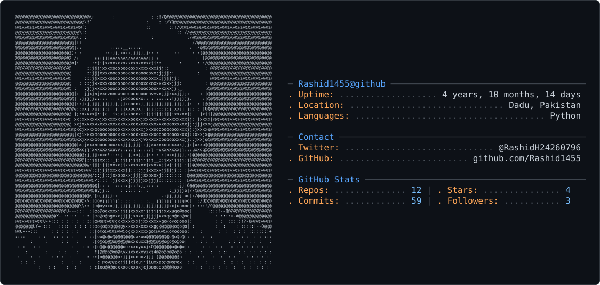

<picture>
  <source media="(prefers-color-scheme: dark)" srcset="dark_mode.svg" />
  <source media="(prefers-color-scheme: light)" srcset="light_mode.svg" />
  
</picture>

# 💫 About Me:
🔭 I’m currently working on AI-powered applications, LLM chatbots, and end-to-end machine learning projects. 🧑‍🤝‍🧑 I’m looking to collaborate on Machine Learning, Computer Vision, Generative AI, and Data Science projects. 🤝 I’m looking for help with MLOps, scalable AI deployment, advanced LLM applications, and production-ready ML systems. 🌱 I’m currently learning Applied Machine Learning, Generative AI, LLMs, Data Engineering, and advanced Deep Learning. 💬 Ask me about Python, Machine Learning, Streamlit, OpenCV, Data Analysis, Computer Vision, and building AI applications. ⚡ Fun fact: I build AI projects that can predict student performance, detect emotions and wildfires, scrape job opportunities, and even power AI chat assistants.

## 🌐 Socials:
           

# 💻 Tech Stack:
                                                       
# 📊 GitHub Stats:
 
 

## 🏆 GitHub Trophies

### ✍️ Random Dev Quote

### 🔝 Top Contributed Repo

---

<!-- Proudly created with GPRM ( https://gprm.itsvg.in ) -->
