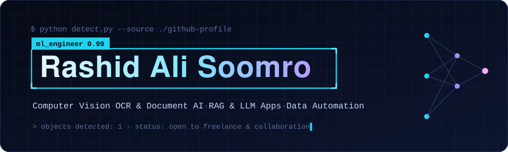

<div align="center">



<a href="https://github.com/Rashid1455">
  
</a>

<br/>

<a href="https://www.linkedin.com/in/rashid-ali-619671357/"></a>
<a href="https://x.com/RashidH24260796"></a>
<a href="https://medium.com/@rashidhussain473888"></a>
<a href="mailto:rashidhussain473888@gmail.com"></a>


</div>

---

### `> whoami`

```python
class RashidAliSoomro:
    location   = "Dadu, Sindh, Pakistan 🇵🇰"
    role       = "IT Graduate · Data Analyst · AI/ML Engineer"
    focus      = ["Computer Vision", "OCR & Document AI", "RAG / LLM apps", "Data Automation"]
    shipping   = "Grounded RAG knowledge base with cited answers (FastAPI + pgvector)"
    learning   = ["MLOps", "Model deployment at scale", "Advanced deep learning"]
    available  = "Freelance & collaboration — let's build something that sees."

    def fun_fact(self):
        return "I've built models that spot wildfires, read résumés, and recognise emotions."
```

---

### 🧪 Featured Builds

<table>
<tr>
<td width="50%" valign="top">

#### 📚 [Sourceboard — RAG Knowledge Base](https://github.com/Rashid1455/Source_Board-Production-RAG-Knowledge-Base-SaaS)
Upload documents, ask questions, get answers where **every claim is backed by a verbatim quote** — or an honest *"insufficient evidence"*.<br/>
<sub>`FastAPI` `pgvector` `Postgres job queue` `Next.js` `Docker`</sub>

</td>
<td width="50%" valign="top">

#### 🔍 [HireLens AI — Explainable Résumé Screening](https://github.com/Rashid1455/HireLens-AI-Explainable-resume-screening)
Ranks PDF résumés against a job description with **transparent scores** and skill evidence, and strips protected attributes before scoring.<br/>
<sub>`PyMuPDF` `scikit-learn` `TF-IDF` `Streamlit` `CI tests`</sub>

</td>
</tr>
<tr>
<td width="50%" valign="top">

#### 🔥 [Wildfire Detection System](https://github.com/Rashid1455/-Wildfire-Detection-System-)
YOLOv8 pipeline for early **fire & smoke detection** on images, video and webcam, with alerts.<br/>
<sub>`YOLOv8` `OpenCV` `PyTorch` `Streamlit`</sub>

</td>
<td width="50%" valign="top">

#### 🧾 [FolioIQ — Document Intelligence](https://github.com/Rashid1455/FolioIQ-intelligent-Document)
Turns invoices & receipts into **structured, reviewable records** with CSV/JSON export.<br/>
<sub>`Next.js` `TypeScript` `Cloudflare D1/R2` `pdf.js`</sub>

</td>
</tr>
<tr>
<td width="50%" valign="top">

#### 📉 [Customer Churn Prediction](https://github.com/Rashid1455/Customer-Churn-Prediction)
Upload any customer table → compare 4 models → **score who's likely to leave**.<br/>
<sub>`scikit-learn pipelines` `pandas` `Streamlit` `pytest`</sub>

</td>
<td width="50%" valign="top">

#### 😄 [Real-Time Emotion Detection](https://github.com/Rashid1455/Emotions_Detection)
Your webcam becomes a **live emotion recognition engine**.<br/>
<sub>`DeepFace` `OpenCV` `TensorFlow`</sub>

</td>
</tr>
</table>

<p align="center"><a href="https://github.com/Rashid1455?tab=repositories"><b>→ explore all repositories</b></a></p>

---

### 🛠️ Toolbox

<p align="center">
  <br/>
  
</p>

<p align="center">
  
  
  
  
  
  
  
  
</p>

---

### 📊 Activity

<div align="center">


</div>

---

<div align="center">

**Need a model that can see, read, or predict?** &nbsp;·&nbsp; [Let's talk →](mailto:rashidhussain473888@gmail.com)

<sub>`> process finished with exit code 0` · thanks for scanning 👀</sub>

</div>
